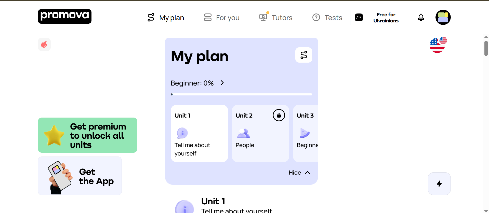

## 🏦 Promova

Promova is an educational platform and mobile app designed to help people learn foreign languages through personalized, interactive, and bite-sized lessons.

---------------
## 🎯Mission
To make language learning simple, personalized, and accessible for everyone around the world.
## 🧠Vision
To become a leading platform that helps people connect through language, grow personally, and succeed globally.
## 📑Contents
- <a>Introduction</a>
- <a>Purpose and Vision</a>
- <a>Key Features</a>
- <a>Languages Offered</a>
- <a>Learning Methods</a>
- <a>Mobile App Experience</a>
- <a>Comparison with Other Platforms</a>
- <a>Benefits & Limitations</a>
- <a>Pricing and Plans</a>
- <a>User Reviews & Feedback</a>
- <a>Conclusion</a>
--------------
## 🎀Features
- Personalized Learning

- Vocabulary & Grammar Practice

- Speaking & Listening Exercises

- Interactive Flashcards

- AI-Powered Tutor

- Progress Tracking

- Bite-Sized Lessons

- Daily Reminders

- Offline Mode
----
## 🌏 Languages Available on Promova
- English

- Spanish

- French

- German

- Italian

- Ukrainian

- Portuguese

- Chinese (Mandarin)

- Arabic

- Japanese

- Korean
## 📚 Languages You Can Learn on Promova
1. English

1. Spanish (including LATAM)

1. French

1. German

1. Korean

1. Japanese

1. Arabic

1. American Sign Language (ASL)

1. Portuguese

1. Chinese (Mandarin)

1. Ukrainian

1. Italian
## 🔐 How it works
- You select a language to learn

- Then choose the language you already speak (to help guide lessons)

- Promova gives you daily lessons, flashcards, speaking practice, and progress tracking.

## 📸Screenshot

## 🔗Link website
IF you want to get more information.Please
<a href="https://promova.com/my-plan/" target="_blank">Click me!</a>

## Contributors

